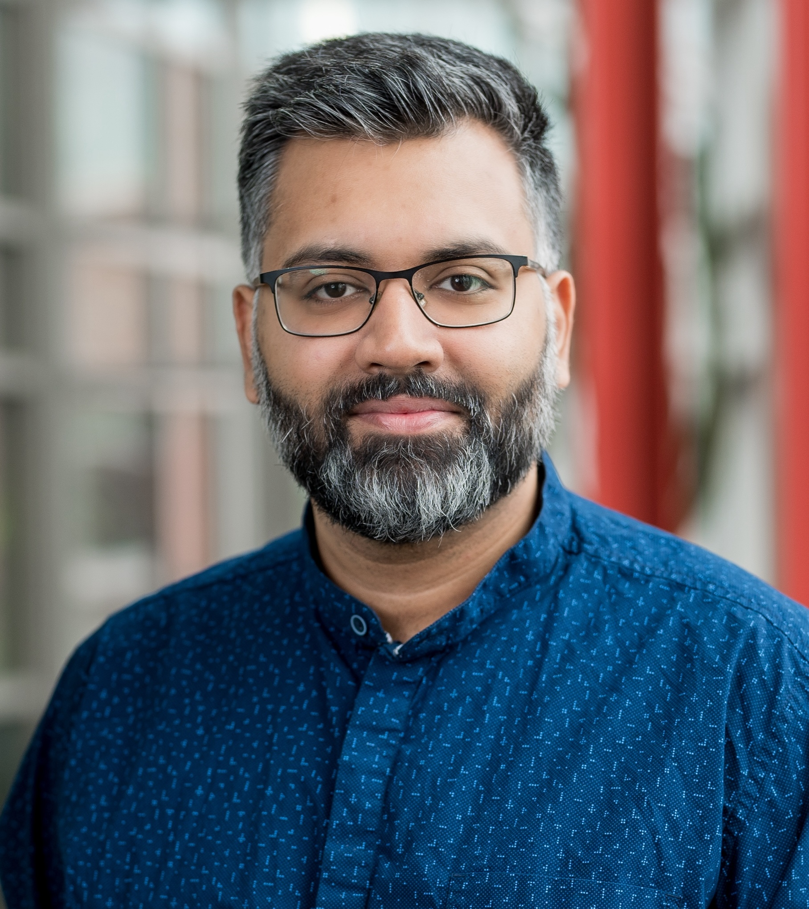
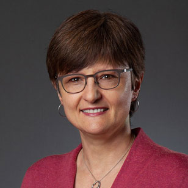

## Koustuv Saha

Koustuv Saha is an Assistant Professor of Computer Science at the University of Illinois Urbana-Champaign, where he leads the OnCARE (Online and Connected AI Reflections) lab. His research lies at the intersection of computational social science, social computing, human-centered machine learning, and fairness, accountability, transparency, and ethics (FATE) in AI.

His work focuses on understanding human behavior and wellbeing through social media and online data, combined with multimodal sensing approaches. By integrating perspectives from psychology and social science, his research contributes to theoretical, practical, design, and ethical discussions relevant to researchers, practitioners, and policymakers.

A significant part of his research examines wellbeing in situated contexts such as college campuses and workplaces. He investigates the real-world utility and ecological validity of wellbeing sensing technologies, while critically assessing their assumptions and potential risks. This work aims to inform the responsible design, development, and deployment of such technologies.

Previously, he was a Senior Researcher at Microsoft Research Montréal in the FATE group. He received his Ph.D. in Computer Science from Georgia Tech and his B.Tech in Computer Science and Engineering from IIT Kharagpur, and brings additional industry research experience from his pre-PhD career.

## Kristina Lerman

Kristina Lerman is a Professor of Informatics at Indiana University’s Luddy School of Informatics, Computing and Engineering and a fellow of the AAAI. Prior to joining Luddy, Kristina Lerman spent 27 years at the University of Southern California, most recently serving as a Senior Principal Scientist at USC Information Sciences Institute. Trained as a physicist, she uses AI, machine learning and network science to answer questions in computational social science. Her research explores how algorithms and platforms shape social behavior and human psychology, as well as access to information, attention and social support. Her work has been covered by the Washington Post, Wall Street Journal, and The Atlantic. 